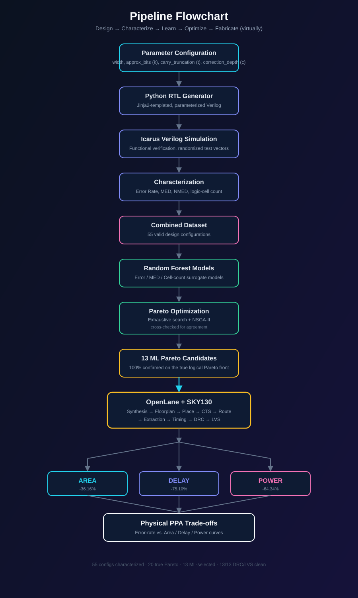
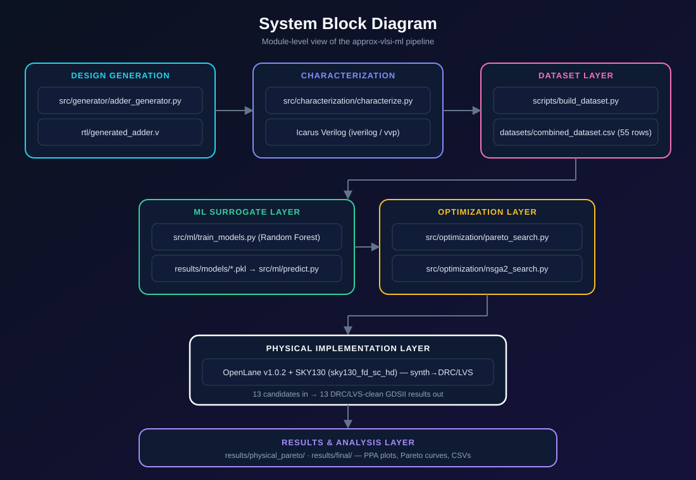

<div align="center">


# ⚡ APPROX-VLSI-ML ⚡
### *Teaching Silicon to Cut Corners — On Purpose, and Proving It Pays Off*

**An end-to-end, Python-automated pipeline that breeds approximate adders, lets Machine Learning pick the winners, and sends the survivors through a real silicon flow to prove it.**

[](https://www.python.org/)
[](https://en.wikipedia.org/wiki/Verilog)
[](https://github.com/The-OpenROAD-Project/OpenLane)
[](https://github.com/google/skywater-pdk)
[](https://scikit-learn.org/)
[](https://pymoo.org/)
[]()

**🔥 64% less power · 75% less delay · 36% less area — for a circuit that's "wrong" 99.6% of the time, on purpose. 🔥**

</div>

---

## 🚨 TL;DR — Why This Repo Exists

Most adders are built to never be wrong. This one is built to be wrong **exactly as much as you let it**, and a machine-learning pipeline figures out precisely how wrong is worth it.

This repo takes one question — *"what if my adder didn't have to be perfect?"* — and drags it through **every single layer of the VLSI stack**: RTL generation → functional simulation → error characterization → ML surrogate modeling → multi-objective evolutionary optimization → **full OpenLane/SKY130 physical implementation with DRC/LVS sign-off**. Not simulated numbers. Not "estimated" power. Actual synthesized, placed, routed, and verified silicon-level metrics.

> **55 approximate adder variants bred → 20 true Pareto-optimal designs found → 13 ML-predicted winners → 13/13 physically validated → 100% of them were right.**

That last number is the whole point of this project.

---

## 🧠 The Big Idea

```text
What if an adder didn't have to be perfect —
and a machine could tell you exactly how imperfect to make it?
```

Approximate computing already proves that deliberately injecting arithmetic error can buy back huge savings in power, delay and area — useful in image processing, ML inference, sensor fusion, anywhere "close enough" is actually enough. The problem: **finding the right amount of "wrong" is a brutal manual search.** Every candidate design needs new RTL, a new simulation, and ideally a trip through a full physical design flow just to see if it was worth it.

This project automates the entire search:

1. **Generate** a family of approximate 16-bit ripple-carry adders in Verilog, purely from three tunable knobs.
2. **Characterize** every valid variant — simulate it, measure its arithmetic error, count its logic cells.
3. **Train** Random Forest surrogate models that learn to *predict* error and hardware cost from the knobs alone — no simulation required.
4. **Optimize** the design space two ways — brute-force exhaustive search *and* NSGA-II evolutionary search — and check that they agree.
5. **Fabricate** (virtually) the ML-selected winners through the real OpenLane + SKY130 RTL-to-GDSII flow.
6. **Prove it** by comparing predicted trade-offs against actual post-layout silicon numbers.

No step is hand-waved. No step is skipped. That's what makes the 100% numbers below worth bragging about.

---

## 🏗️ System Architecture

### Flowchart — the pipeline, stage by stage

<div align="center">

</div>

### Block Diagram — modules and data flow

<div align="center">

</div>


---

## ⚙️ The Circuit: A 16-bit Adder That Knows How to Cheat

A conventional ripple-carry adder, split into two personalities:

```text
              16-bit Approximate Ripple-Carry Adder

        ┌──────────── Approximate Region ────────────┐
        │                                             │
 A,B →  │  Approximate FA → Approximate FA → ...      │
        │        │                 │                  │
        └────────┼─────────────────┼──────────────────┘
                 │
                 ▼
        ┌──────────────────┐
        │ Correction Region│
        │   Exact Logic    │
        └────────┬─────────┘
                 │
                 ▼
              SUM[15:0]
```

In the **approximate region**, `Sum ≈ A XOR B` with carry logic deliberately simplified or truncated. In the **correction region**, exact full-adder logic is restored for the lowest bits that matter most for accuracy. Three dials control exactly how aggressive the approximation gets:

| Parameter          | What it controls                                 | Range |
|---------------------|---------------------------------------------------|------:|
| `approx_bits`       | How many low-order bits go approximate            |  0–8  |
| `carry_truncation`  | How many carries in that region get forced to 0   |  0–8  |
| `correction_depth`  | How many of those bits get exact logic restored   |  0–4  |

Only physically/logically valid combinations survive filtering — which is how **55 valid configurations** emerge from the full parameter space, at a fixed width of **16 bits**.

---

## 📁 Repository Structure

```text
approx-vlsi-ml/
│
├── rtl/
│   └── generated_adder.v
│
├── tests/
│   └── test_approx_adder.v
│
├── datasets/
│   ├── characterization.csv
│   ├── hardware_characterization.csv
│   └── combined_dataset.csv
│
├── results/
│   ├── models/
│   │   ├── error_rate_model.pkl
│   │   ├── MED_model.pkl
│   │   └── cell_count_model.pkl
│   │
│   ├── optimization/
│   │   ├── pareto_predictions.csv
│   │   ├── nsga2_predictions.csv
│   │   ├── optimizer_comparison.csv
│   │   ├── nsga2_physical_validation.csv
│   │   └── pareto_comparison.png
│   │
│   ├── physical_pareto/
│   │   ├── physical_pareto.csv
│   │   ├── ppa_summary.csv
│   │   ├── error_vs_area.png
│   │   ├── error_vs_delay.png
│   │   └── error_vs_power.png
│   │
│   ├── merged/
│   │   └── physical_logical_dataset.csv
│   │
│   └── final/
│       ├── final_results.csv
│       └── plots/
│           ├── ml_error_rate_actual_vs_predicted.png
│           ├── ml_MED_actual_vs_predicted.png
│           ├── ml_cell_count_actual_vs_predicted.png
│           └── physical_ppa_improvement.png
│
├── scripts/
│   ├── build_dataset.py
│   ├── build_final_results.py
│   ├── compare_optimizers.py
│   ├── extract_openlane_metrics.py
│   ├── merge_physical_logical.py
│   ├── physical_pareto.py
│   ├── physical_tradeoff_plots.py
│   ├── plot_ml_predictions.py
│   ├── plot_ml_validation.py
│   ├── plot_pareto.py
│   ├── ppa_summary.py
│   ├── run_pipeline.py
│   ├── run_yosys.py
│   ├── validate_dataset.py
│   ├── validate_nsga2_physical.py
│   └── validate_pareto.py
│
├── src/
│   ├── generator/
│   │   └── adder_generator.py
│   │
│   ├── characterization/
│   │   └── characterize.py
│   │
│   ├── ml/
│   │   ├── train_models.py
│   │   └── predict.py
│   │
│   ├── optimization/
│   │   ├── pareto_search.py
│   │   └── nsga2_search.py
│   │
│   ├── application/
│   ├── physical/
│   └── utils/
│
└── README.md
```

---

## 🧰 Tech Stack

| Layer | Tooling |
|---|---|
| RTL generation | Python + Jinja2 |
| Functional simulation | Icarus Verilog (`iverilog`, `vvp`) |
| Dataset / glue code | Python, pandas, numpy |
| Surrogate ML | scikit-learn — Random Forest Regression |
| Multi-objective optimization | pymoo — NSGA-II |
| Physical implementation | OpenLane v1.0.2 |
| PDK / standard cells | SKY130 — `sky130_fd_sc_hd` |
| Visualization | matplotlib |

---

## 🚀 Getting Started

### 1. Prerequisites

```text
Python 3.9+   (developed on 3.9.14)
Icarus Verilog (iverilog, vvp)
Docker / WSL   (for OpenLane, physical validation only)
```

### 2. Clone & set up the environment

```powershell
git clone <YOUR-GITHUB-REPOSITORY-URL>
cd approx-vlsi-ml

python -m venv .venv
.venv\Scripts\Activate.ps1

pip install numpy pandas scikit-learn jinja2 pymoo matplotlib joblib
```

### 3. Sanity-check your tools

```powershell
python --version
iverilog -V
vvp -V
```

---

## 🔁 The Full Pipeline, Start to Finish

Run it exactly in this order and you'll reproduce every number in this README.

```powershell
# Activate environment
.venv\Scripts\Activate.ps1

# 1 — Characterize approximate designs (RTL gen + sim + error metrics)
python src\characterization\characterize.py

# 2 — Build the combined logical dataset
python scripts\build_dataset.py

# 3 — Sanity-check the dataset
python scripts\validate_dataset.py

# 4 — Train the Random Forest surrogate models
python src\ml\train_models.py

# 5 — Try the models on new, unseen configs
python src\ml\predict.py

# 6 — Exhaustive ML-based Pareto search
python src\optimization\pareto_search.py

# 7 — NSGA-II evolutionary Pareto search
python src\optimization\nsga2_search.py

# 8 — Do the two optimizers agree?
python scripts\compare_optimizers.py

# 9 — Validate the ML-selected Pareto candidates against ground truth
python scripts\validate_pareto.py

# 10 — Generate every plot
python scripts\plot_ml_validation.py
python scripts\plot_pareto.py
python scripts\physical_tradeoff_plots.py
python scripts\plot_physical_improvement.py
```

Then — **once the 13 ML-selected candidates have been pushed through OpenLane** — close the loop with real silicon numbers:

```powershell
python scripts\extract_openlane_metrics.py
python scripts\merge_physical_logical.py
python scripts\physical_pareto.py
python scripts\ppa_summary.py
python scripts\validate_nsga2_physical.py
python scripts\build_final_results.py
```

---

## 🤖 Machine Learning Layer

Three **Random Forest Regressors** learn to predict circuit behavior from nothing but three structural knobs (`approx_bits`, `carry_truncation`, `correction_depth`):

```text
n_estimators     = 200
max_depth        = 8
min_samples_leaf = 1
random_state     = 42
```

### 5-Fold Cross-Validation Results

| Target | 5-Fold R² |
|---|---:|
| Error Rate | 0.427 ± 0.364 |
| MED | **0.969 ± 0.048** |
| Logical Cell Count | **0.862 ± 0.103** |

> 🎯 The error-rate model is noisier simply because the explored space is small and highly discrete — not because the approach breaks down. MED and cell-count prediction are strong enough to drive real design decisions.

---

## 🧬 Optimization Showdown: Brute Force vs. Evolution

Two completely independent search strategies were pointed at the same ML surrogate models, with zero coordination between them:

- **Exhaustive search** — every valid configuration, scored by the ML models, filtered to the non-dominated front.
- **NSGA-II** — a real evolutionary multi-objective optimizer (pop=40, gens=50, seed=42) searching the same space blind.

### 🥊 The Result

```text
Exhaustive Pareto designs : 13
NSGA-II Pareto designs    : 13
Common designs            : 13
NSGA-II coverage          : 100.00%

NSGA-II only designs      : 0
Exhaustive-only designs   : 0

OPTIMIZER AGREEMENT: PASS ✅
```

**NSGA-II found the exact same 13 designs as brute-force search — not close, identical.** That's not a coincidence; it's the signature of a well-posed, well-characterized design space.

---

## 🎯 From ML Prediction to Logical Ground Truth

| Stage | Count |
|---|---:|
| Total characterized configurations | 55 |
| **True** logical Pareto front | 20 |
| ML-predicted Pareto front | 13 |
| ML candidates confirmed on the real Pareto front | **13 / 13** |

```text
ML Pareto hit rate = 100%
```

Every single design the ML pipeline recommended was, in fact, genuinely Pareto-optimal. Zero false positives.

---

## 🏭 Physical Validation: Where It Gets Real

The 13 ML-selected candidates weren't just trusted on prediction — they were pushed through a **complete OpenLane RTL-to-GDSII flow**:

```text
PDK       : SKY130
Library   : sky130_fd_sc_hd
OpenLane  : v1.0.2

Synthesis → Floorplanning → Placement → CTS → Routing
   → Extraction → Timing Analysis → DRC → LVS
```

### 🏆 100% Across the Board

```text
NSGA-II candidates       : 13
Physically implemented   : 13
DRC/LVS clean            : 13
Physical coverage        : 100.00%
Clean validation rate    : 100.00%
```

Every design the ML model picked not only simulated correctly — it **taped out clean**.

---

## 📊 The Headline Numbers: Exact vs. Most-Aggressive

| Metric | Exact Baseline (`k0_t0_c0`) | Most Aggressive (`k8_t8_c0`) | Improvement |
|---|---:|---:|---:|
| Error Rate | 0 | 0.996 | — (by design) |
| Area | 1961.8816 µm² | 1252.4512 µm² | 🟢 **36.16% smaller** |
| Critical Path | 7.55 ns | 1.88 ns | 🟢 **75.10% faster** |
| Power | 0.0001318 µW | 0.0000470 µW | 🟢 **64.34% lower** |

> ⚠️ **`k8_t8_c0` is not "the best design" — it's the most extreme point on the curve.** With a 99.6% error rate, it's only appropriate where correctness barely matters at all. The real contribution isn't this one data point; it's the **full Pareto curve** connecting it back to the exact baseline, so *any* application can pick the trade-off that fits.

---

## 📈 Generated Plots & Results

**ML Validation:**
```text
results/final/plots/ml_error_rate_actual_vs_predicted.png
results/final/plots/ml_MED_actual_vs_predicted.png
results/final/plots/ml_cell_count_actual_vs_predicted.png
```

**Optimization:**
```text
results/optimization/pareto_comparison.png
```

**Physical Trade-offs:**
```text
results/physical_pareto/error_vs_area.png
results/physical_pareto/error_vs_delay.png
results/physical_pareto/error_vs_power.png
results/final/plots/physical_ppa_improvement.png
```

**Key datasets:**
```text
datasets/combined_dataset.csv
results/final/final_results.csv
results/optimization/optimizer_comparison.csv
results/optimization/nsga2_physical_validation.csv
results/physical_pareto/physical_pareto.csv
results/physical_pareto/ppa_summary.csv
```

---

## 🏁 Final Scoreboard

```text
========================================================
PROJECT RESULTS
========================================================
Design space                    : 55 configurations
Actual logical Pareto           : 20 designs
ML-selected Pareto              : 13 designs
NSGA-II coverage                : 100%
NSGA-II agreement               : PASS

Physically validated            : 13 / 13
Physical validation coverage    : 100%
DRC/LVS clean candidates        : 13 / 13
--------------------------------------------------------
Best measured PPA point         : k8_t8_c0
  Area reduction                : 36.16%
  Critical-path reduction       : 75.10%
  Power reduction               : 64.34%
  Error rate                    : 0.996
========================================================
```

---

## 🧭 Why This Matters (The Research Contribution)

Most approximate-computing papers stop at RTL or gate-level estimates. This project doesn't:

```text
Approximate Arithmetic
        +
Python Automation
        +
RTL Characterization
        +
Machine Learning
        +
Multi-Objective Optimization
        +
Physical Design Validation (DRC/LVS-clean, real PPA)
```

The entire chain — from a tunable knob in Python to a DRC/LVS-clean GDSII-level result — is automated, reproducible, and closed-loop: the ML surrogate's predictions are *checked* against physical reality, not just trusted.

```text
Approximation parameters
        ↓
Arithmetic error
        ↓
Logical hardware cost
        ↓
Physical PPA
```

---

## 🔬 Scope & Honest Limitations

This is a research-grade exploration, not a claim of universal generality — and it's stronger for saying so out loud:

- **Dataset size**: 55 valid configurations, 13 physically validated — enough to prove the pipeline works, not yet a massive design-space study.
- **Single architecture**: 16-bit approximate ripple-carry adder only, for now.
- **ML generalization**: models are trained and evaluated *within* this parameterized family, not across unrelated circuit topologies.
- **Error-rate prediction** is the weakest surrogate (R² = 0.427) — trust MED and cell-count predictions more.
- **NSGA-II optimizes predicted error rate and logical cell count** — not post-layout PPA directly; physical numbers are measured *after* candidate selection, not optimized against directly.
- **OpenLane results depend on**: PDK, standard-cell library, floorplanning, utilization, timing constraints, routing configuration, and OpenLane version — treat all physical numbers as tied to this specific implementation setup.

---

## 🛣️ Roadmap

- [ ] Larger, denser approximate-circuit datasets
- [ ] Approximate multipliers and MAC units
- [ ] Bayesian optimization as a third search strategy
- [ ] XGBoost / LightGBM / neural-network surrogates
- [ ] Uncertainty-aware ML prediction (confidence intervals, not just point estimates)
- [ ] Direct physical-PPA surrogate modeling (skip the logical proxy entirely)
- [ ] Active learning to pick the *next* most informative design to characterize
- [ ] Multi-bitwidth exploration (8/16/32-bit families)
- [ ] Energy estimation and application-level quality metrics (PSNR/SSIM workloads)
- [ ] Automated GDSII comparison and experiment tracking

---

## 🔁 Reproducibility

Every randomized component is pinned:

```text
Random Forest random_state = 42
NSGA-II seed                = 42
NSGA-II population          = 40
NSGA-II generations         = 50
Adder width                 = 16
```

Clone it, run the pipeline in order, and you should land on the exact same scoreboard above.

---

## 👤 Author

**Pradyut Arvind Manjarekar**
Electronics & Telecommunication Engineering
Sardar Patel Institute of Technology, Mumbai

**Interests:** VLSI Design · Approximate Computing · Machine Learning for EDA · RF & Embedded Systems · Digital Hardware Design · Physical Design Automation

---

<div align="center">

### 🎬 The One-Line Pitch

**Python designs the circuit. Machine Learning picks the trade-off. Silicon proves them both right.**

*The goal was never one "perfect" approximate adder —*
*it was building the machine that finds the right amount of imperfection, automatically, and proving it on real silicon.*

⭐ **If this pipeline is useful to you, star the repo — it helps a lot.** ⭐

</div>
